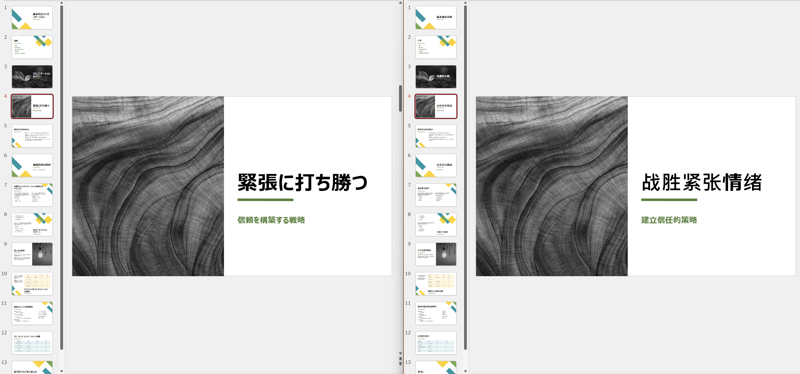

# LLM PPT Translator

## UI Preview


## Installation

```
conda create -n llm-ppt-translator python=3.11 -y
conda activate llm-ppt-translator
```

```
pip install -r requirements.txt
# pip list --format=freeze > requirements.txt
```

## Configration

```
cp .env.example .env
```

Modify the following parameters:

- For OCI GenAI
```
COMPARTMENT_ID=ocid1.compartment.oc1..******
CONFIG_PROFILE=DEFAULT
```

- For OpenAI API
```
OPENAI_API_KEY=sk-******
OPENAI_BASE_URL=http://xxx.xxx.xxx.xxx:8000/v1
OPENAI_MODEL_NAME=gpt-4
```

## Run

```
python main.py
```

## Access

Open [http://127.0.0.1:8080](http://127.0.0.1:8080)

## Limitation

- Not support SmartART

## Welcome to WeChat


## Translated Result Samples





